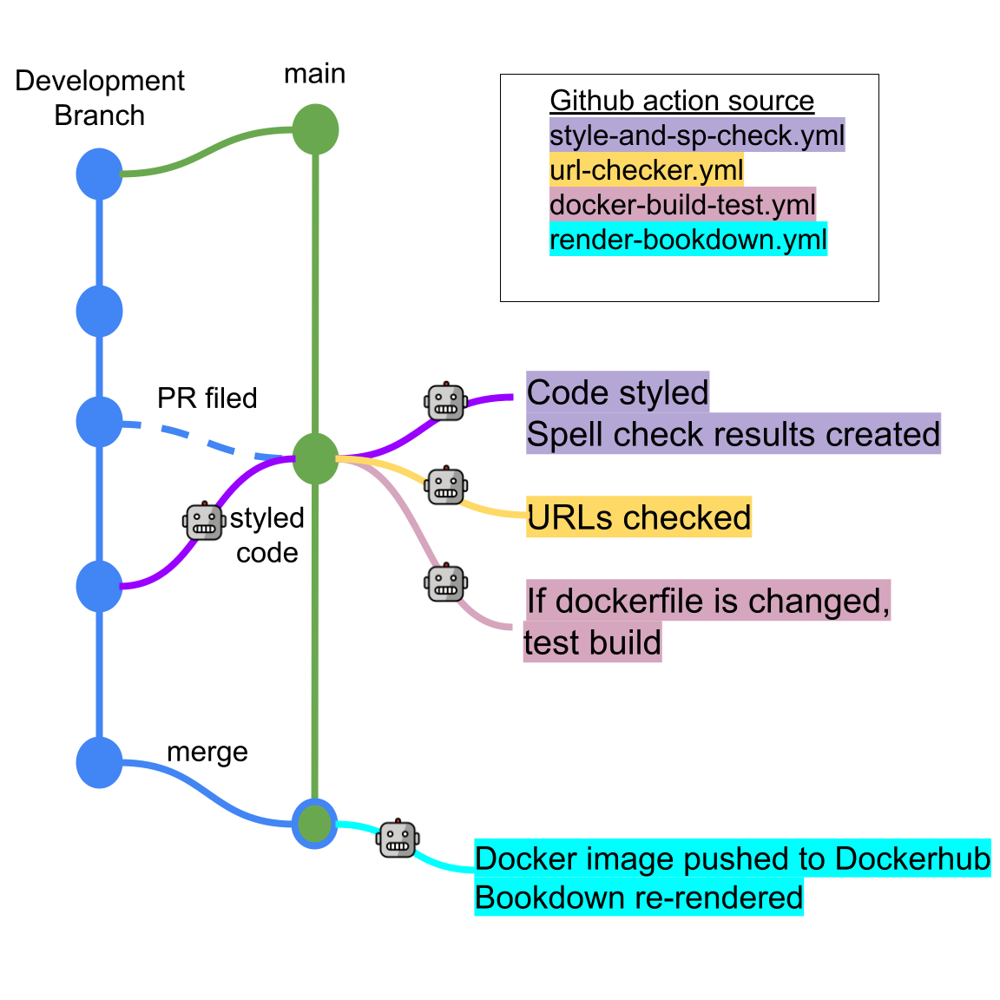

# Contributing Guidelines for ITCR Course Template

This template includes all of the files that you need to get started creating your course in [R Markdown](https://rmarkdown.rstudio.com/) using the [bookdown package](https://bookdown.org/).

Please take a look at the [code of conduct](./code_of_conduct.md).

<!-- START doctoc generated TOC please keep comment here to allow auto update -->
<!-- DON'T EDIT THIS SECTION, INSTEAD RE-RUN doctoc TO UPDATE -->
**Table of Contents**  *generated with [DocToc](https://github.com/thlorenz/doctoc)*

- [Creating your course](#creating-your-course)
  - [Recommended repository settings:](#recommended-repository-settings)
- [Setting up the Docker image](#setting-up-the-docker-image)
  - [Starting a new Docker image](#starting-a-new-docker-image)
  - [Adding packages to the Dockerfile](#adding-packages-to-the-dockerfile)
    - [Template commands for adding packages to the Dockerfile](#template-commands-for-adding-packages-to-the-dockerfile)
    - [Rebuilding the Docker image](#rebuilding-the-docker-image)
- [Citations](#citations)
- [Github actions](#github-actions)
  - [Style guide](#style-guide)
  - [Spell check](#spell-check)
  - [Running spell check and styler manually](#running-spell-check-and-styler-manually)
  - [URL Checking](#url-checking)
  - [Adding Images and Graphics](#adding-images-and-graphics)
- [Bookdown Rendering](#bookdown-rendering)

<!-- END doctoc generated TOC please keep comment here to allow auto update -->

## Creating your course

In the upper right of this screen, click `Use this template` and follow the steps to set up your course's GitHub repository.

Name your repository, starting with `ITCR_` and fill in a short description.

Now start filling out the documents with the information for the course! Make sure that the existing Rmd template files are changed to fit your course, and delete the `code_output` folder if you do not expect to have any code_output (or if you wish to call the folder something else).
There are `{}` in these files to get you started filling out information and should be deleted after you've filled them out.

### Recommended repository settings:

With your course repository set up, there are some settings recommended for development.

#### Set up GitHub pages

Go to `Settings` > `Pages`.

- Under `Source`, pick the drop down menu and pick `main` and `/docs`.  
- Then click `Save`.  
- Lastly, check the box that says `Enforce HTTPS` at the bottom of this page.   

##### Set up branches

Go to `Settings` > `Branches` and click `Add new rule`.
For `Branch name pattern`, put `main`.

_Protect the main branch_:  
Then check the box that says `Require pull request reviews before merging`.

_Make sure branches are updated_:  
Underneath the checkbox of `Require status checks to pass before merging`, also choose `Require branches to be up to date before merging`.

_Use automatic spell and URL checks_:  
You will have to file on initial pull request before setting this.
But then check the box that says `Require status checks to pass before merging` and choose `style-n-check` as well as `url-check`

## Setting up the Docker image

Particularly for courses that involve running example code, it's recommended that you use a Docker image for development to maintain software version consistency across course developers.
If you haven't installed Docker desktop (or need to update it), you can do [so here](https://docs.docker.com/get-docker/).
You will need to [sign up with a Docker account](https://hub.docker.com/) if you don't have one.

If your Docker desktop is running, you should see a Docker whale in your tool bar.
On Macs, this will be on the bar on the top of your screen; in Windows, on the bottom right.

To pull the Docker image associated with this template, you can run this command in your command line.
Pulling the image may take a minute or so.

```
docker pull jhudsl/itcr_course_template
```
Alternatively, if you'd prefer to build from the Dockerfile locally you can run:

```
docker build -< docker/Dockerfile -t jhudsl/itcr_course_template
```

To use the Docker image associated with the course template, first navigate to the the top of this GitHub repository.
Now you can start up the Docker container using the command below.
Replace all of `<CHOOSE_PASSWORD>` (including the `<` and `>`) with a password of your choosing.

```
docker run -it -v $PWD:/home/rstudio -e PASSWORD=<CHOOSE_PASSWORD> -p 8787:8787 jhudsl/itcr_course_template
```

Do not close this window, but you can minimize it.
Open up a new command line window and run the command: `docker ps`, you should see a container is up and running!

In a web browser navigate to the following to get to an RStudio that is ran from your Docker container.

```
localhost:8787
```

To log in, you'll need to use `rstudio` as the username and whatever password you put for `<CHOOSE_PASSWORD>` in the above command.

_Couple other handy Docker commands:_  
- To stop your Docker container, run `docker ps` to obtain the docker container ID.
Then you can use that ID to run `docker stop <CONTAINER_ID>`.  
- To remove a docker image (which you may need to do from time to time to clear out space), you can run `docker image ls` to see all your current images.
Then you can run either `docker image rm <IMAGE_ID>`.  
- If you really need to clear out space, you can follow this [StackOverflow post](https://stackoverflow.com/questions/44785585/docker-how-to-delete-all-local-docker-images) on how to remove all images and all containers.  

For more info on how to use Docker, they have very [extensive documentation here](https://docs.docker.com/).

### Starting a new Docker image

Should you find that your course needs additional packages beyond what's included in the template, you should probably start a new Docker image.

To start up a new Docker image for your new course, you can start with the Dockerfile in this repository and add the additional packages you need using the tips in the next section, but you'll need to change the tag.

### Adding packages to the Dockerfile

If you find you need a new package to run the code you are adding, you'll need to add the package to the `docker/Dockerfile`.

Try to keep things in alphabetical order where possible.

#### Template commands for adding packages to the Dockerfile

For R packages installed from CRAN, you can add to the running vector list of R packages.

To add an R package from Bioconductor, you can follow this kind of format:

```
RUN Rscript -e "options(warn = 2); BiocManager::install( \
  c('limma', \
    'newpackagename')

```

To add an R package from GitHub you can add a line that follows this general format:

```
RUN Rscript -e "remotes::install_github('gitrepo_slug', ref = 'COMMIT_ID', dependencies = TRUE)"
```

To add a Python package, you will need to add pip3 to install Python packages using this format:
```  
RUN pip3 install \
    "somepackage==0.1.0"
```

#### Rebuilding the Docker image

When you've added a package to the Dockerfile, you'll need to check that it builds successfully before including it in a pull request.
You'll need to rebuild the docker image using this command:
```
docker build -< docker/Dockerfile -t jhudsl/itcr_<TAG_FOR_COURSE>
```
If it fails, often the issue is a missing dependency.
Take a look at the error messages and see if you can determine the issue with some Googling.

Once it builds successfully, you should file a PR with your Dockerfile changes.
Once the changes are accepted and merged, we'll need to push the updated image to Dockerhub using:

```
docker push jhudsl/itcr_<TAG_FOR_COURSE>
```

When you file a pull request, the Dockerfile build will be tested automatically by the [GitHub actions](#github-actions).

## Citations

You can generally follow the [Bookdown instructions about citations](https://bookdown.org/yihui/rmarkdown-cookbook/bibliography.html), but you don't need to add the additional bibliography argument at the top of the Rmds.

To add a new reference source, add to the `book.bib` file, keeping your new entry in alphabetical order.

For articles (or anything with a DOI), go to [doi2bib.org](https://www.doi2bib.org/) to get a BibTex-formatted reference.
Then copy and paste the reference to the `references.bib` file.

Other sources can be added using this template:
```
@website{citekey,
    author = {First Last},
    title = {Title},
    url  = {http://www.someurl.html},
}
```

To reference the citations in your writing follow the [bookdown instructions](https://bookdown.org/yihui/rmarkdown-cookbook/bibliography.html):

> Items can be cited directly within the documentation using the syntax @key where key is the citation key in the first line of the entry, e.g., @R-base. To put citations in parentheses, use [@key]. To cite multiple entries, separate the keys by semicolons, e.g., [@key-1; @key-2; @key-3]. To suppress the mention of the author, add a minus sign before @, e.g., [-@R-base].

## Github actions

Here's a summary of the Github actions set up in this repository.



### Style guide

Github actions will run the [`styler` package to all style R in all Rmds](https://github.com/jhudsl/ITCR_Course_Template_Bookdown/blob/main/.github/workflows/style-and-sp-check.yml) whenever a pull request to the `main` branch is filed.
Style changes will automatically be committed back to your branch.

### Spell check

Github actions will automatically [run a spell check on all Rmds](https://github.com/jhudsl/ITCR_Course_Template_Bookdown/blob/main/.github/workflows/style-and-sp-check.yml) whenever a pull request to the `main` branch is filed.

It will fail if there are more than 2 spelling errors and you'll need to resolve those before being able to merge your pull request.

To resolve those spelling errors, go to this repository's `Actions` tab.
Then, click on the GitHub action from the PR you just submitted.
Scroll all the way down to `Artifacts` and click `spell-check-results`.
This will download a zip file with a TSV that lists all the spelling errors.

Some of these errors may be things that the spell check doesn't recognize for example: `ITCR`.
If it's a 'word' the spell check should recognize, you'll need to add this to the dictionary.

Go to the `resources/dictionary.txt` file.
Open the file and add the new 'word' to its appropriate place (the words are in alphabetical order).
Then commit the changes to `resources/dictionary.txt` to your branch and this should make the spell check status check pass.

### Running spell check and styler manually

If you are using the [Docker container](#setting-up-docker-image), or otherwise have the `spelling` and `styler` package installed, you can run spell check and styling locally on all Rmds by running this:

```
Rscript scripts/spell-check.R
```

The spell check results file will be saved to a file called `spell_check_results.tsv`.
This file should not be pushed to the GitHub repository (it is in the gitignore so this shouldn't happen).

### URL Checking

[GitHub actions](#github-actions) runs a check on all the URLs upon creating a pull request to the `main` branch.
If it fails, you'll need to go the `Actions` tab of this repository, then find the GitHub `check_urls` job for the last commit you just pushed.
Click on `check_urls` and the specific step of `Check URLs` to see a print out of the URLs tested.

If the URL checker is trying to check something that isn't really a URL or doesn't need to be checked, open up the GitHub actions file: `.github/workflows/url-checker.yml` and add the imposter URL on to the end of the quote with a comma.

### Adding Images and Graphics

To maintain style and attributions for graphics and images, as well as to enable easy updates in the future, please start a new Google Slide document for your course and import this the theme from this [template](https://docs.google.com/presentation/d/1-7UvgVq5tP1pasTEErUM3bJFH2fU_pilH6i6_81CCXU/edit?usp=sharing).

See [this video](https://youtu.be/pNbwF263yY8) for assistance on how to import themes.

For any major point, please select this layout:


For itemized lists, please select this layout:


Please select the layout that looks like this for any images/content from outside sources:


Please update the text at the bottom to describe the source.

Once complete, your slides can be downloaded and a static version can be added to your bookdown and or Leanpub repository to build your course. See [this link](https://www.howtogeek.com/509046/how-to-save-google-slides-objects-as-images/) for information on how to download slides from Google Slides.

## Bookdown Rendering

As you modify the names of the chapters of your course and add more chapters (using the `.Rmd` files), you need to update the `_bookdown.yml` file accordingly.

For example let's say that we added another chapter and named the file `03-chapter_of_course.Rmd`. We would update our `_bookdown.yml` to look like this:

```yaml
book_filename: "ITCR_Course_Name"  
chapter_name: "Chapter "  
repo: https://github.com/jhudsl/ITCR_Course_Template/ ##Make sure you update this for your GitHub Repo!!  
rmd_files: ["index.Rmd",  
            "01-intro.Rmd",   
            "02-chapter_of_course.Rmd",   
            "03-chapter_of_course.Rmd",  ##Only this is new!
            "about.Rmd"]  
new_session: yes  
delete_merged_file: true  
language:  
  ui:  
    chapter_name: "Chapter "  
output_dir: "docs"  
```

Notice how only one line is different - the one that says `03-chapter_of_course.Rmd",`
Be careful about quotation marks: `""` as well as commas: `,`!

Once we do this we can preview the book!

You can do so by typing:
`bookdown::serve_book()` in the RStudio Console.  

You will then see a live version of your book in your RStudio viewer.

Note that When a pull request is merged to main, `bookdown::render_book()` will be re-run by the [GitHub actions](#github-actions) and the results added to `main`.
