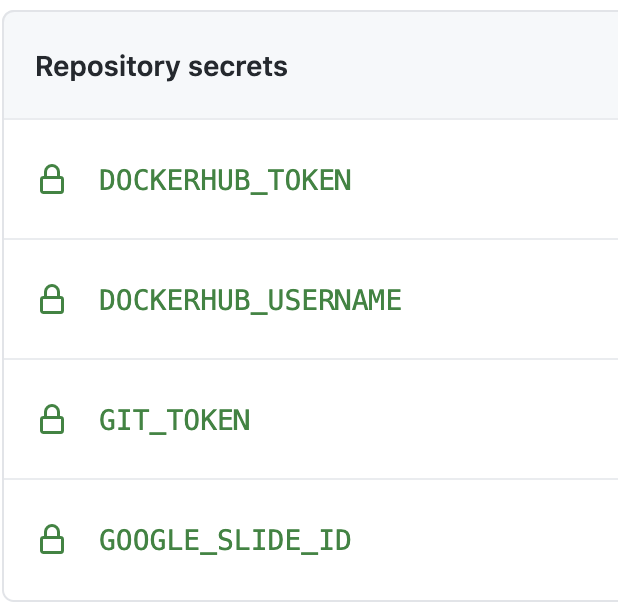

# Contributing Guidelines for this Course Template

This template includes all of the files that you need to get started creating your course in [R Markdown](https://rmarkdown.rstudio.com/) using the [bookdown package](https://bookdown.org/).

Please take a look at the [code of conduct](./code_of_conduct.md).

_Note all materials in this template are licensed [CC-BY](https://tldrlegal.com/license/creative-commons-attribution-(cc)) and can be repurposed freely with attribution._

_Background information_:  
- If you are not familiar with Git and Github, we recommend looking through [Happy Git and GitHub for the UseR by Jenny Bryan](https://happygitwithr.com/).  
- If you aren't familiar with markdown files [this is a nice introduction](https://www.markdownguide.org/getting-started/).  
- For information on RMarkdown files: [RStudio has their lessons here](https://rmarkdown.rstudio.com/lesson-1.html).  

<!-- START doctoc generated TOC please keep comment here to allow auto update -->
<!-- DON'T EDIT THIS SECTION, INSTEAD RE-RUN doctoc TO UPDATE -->
**Table of Contents**  *generated with [DocToc](https://github.com/thlorenz/doctoc)*

- [Creating your course](#creating-your-course)
  - [Recommended repository settings:](#recommended-repository-settings)
    - [Set up GitHub pages](#set-up-github-pages)
      - [Set up branches](#set-up-branches)
  - [Set up Github secrets](#set-up-github-secrets)
- [Setting up the Docker image](#setting-up-the-docker-image)
  - [Starting a new Docker image](#starting-a-new-docker-image)
  - [Adding packages to the Dockerfile](#adding-packages-to-the-dockerfile)
    - [Template commands for adding packages to the Dockerfile](#template-commands-for-adding-packages-to-the-dockerfile)
    - [Rebuilding the Docker image](#rebuilding-the-docker-image)
- [Citations](#citations)
- [Github actions](#github-actions)
  - [Linking to Leanpub repository](#linking-to-leanpub-repository)
  - [Style guide](#style-guide)
  - [Spell check](#spell-check)
  - [Running spell check and styler manually](#running-spell-check-and-styler-manually)
  - [URL Checking](#url-checking)
  - [Adding logo](#adding-logo)
  - [Adding Images and Graphics](#adding-images-and-graphics)
    - [Themes for non-ITCR projects:](#themes-for-non-itcr-projects)
    - [Themes for ITCR project:](#themes-for-itcr-project)
- [Learning Objectives Formatting](#learning-objectives-formatting)
- [Bookdown Rendering](#bookdown-rendering)

<!-- END doctoc generated TOC please keep comment here to allow auto update -->

## Creating your course

In the upper right of this screen, click `Use this template` and follow the steps to set up your course's GitHub repository.

Name your repository fill in a short description (If this is an ITCR course, start the repo name with `ITCR_`).

_Trigger the workflow to set up the Github issues that you can use to guide your set up of this course_:   
- Go to `Actions` > under `Workflows` click on `Issue Filer`.
- Where it says `This workflow has a workflow_dispatch event trigger.` click `Run workflow` and then click the green button that says `Run workflow`.
- Now if you go to `Issues` you will see issues filed that you can follow to set up the new course!

Now start filling out the documents with the information for the course!

_If you are creating an ITCR course:_

- Delete `_output.yml` and `index.Rmd` files
- Keep the `_output-itcr.yml` and `index-itcr.Rmd` files but delete the `-itcr` parts of those file names.

_If you are creating any other courses:_

- Delete the `_output-itcr.yml` and `index-itcr.Rmd` files.

Now, you can go through each file (the issues have checklists to guide you) and make sure the existing Rmd template files are changed to fit your course, and delete the `code_output` folder if you do not expect to have any code output (or if you wish to call the folder something else).
There are `{}` in these files to get you started filling out information and should be deleted after you've filled them out.

### Recommended repository settings:

With your course repository set up, there are some settings recommended for development.

#### Set up GitHub pages

Go to `Settings` > `Pages`.

- Under `Source`, pick the drop down menu and pick `main` and `/docs`.  
- Then click `Save`.  
- Lastly, check the box that says `Enforce HTTPS` at the bottom of this page.   

##### Set up branches

Go to `Settings` > `Branches` and click `Add rule`.
For `Branch name pattern`, put `main`.

_Protect the main branch_:  
Then check the box that says `Require pull request reviews before merging`.

_Make sure branches are updated_:  
- Check the box that says `Require status checks to pass before merging`.
- Underneath this also check the box that says `Require branches to be up to date before merging`.

_Use automatic spell and URL checks_:  
After the first pull request, a couple of checks will automatically happen and then appear here in settings.
Then, you can require these checks to pass before merging pull requests by returning here and selecting them - they are `url_check` and `style-n-check` they will check that the urls work and that the code is styled using the `stylr` package and that the spelling is correct using the spelling package respectively.
See the [Github Actions section](#github-actions) for more details on these.

After setting up these new branch items, click `Create` and `Save changes`.

### Set up Github secrets

The Github actions that this repository uses needs four Github secrets set up.

It's important that these are set up and named exactly what they are below in order for Github actions to work correctly.



To set up these repository secrets, on your repository's main Github page, go to `Settings` and scroll down to see `Secrets` on the left side menu bar.

For each new secret, click the `New repository secret` button and set each as follows, clicking `Add secret` as you fill each in appropriately:  

_Name: `DOCKERHUB_USERNAME`_:  
For `value`: put your login username for https://hub.docker.com/

_Name: `DOCKERHUB_TOKEN`_:   
For `value`: put a access token for Dockerhub.
You can create this by following [these instructions](https://docs.docker.com/docker-hub/access-tokens/#create-an-access-token).

_Name: `GIT_TOKEN`_:  
For `value`: Create a personal access token [following these instructions](https://docs.github.com/en/github/authenticating-to-github/creating-a-personal-access-token#creating-a-token). Underneath `Select scopes`, check both `repo` and `workflow`.
Then copy the PAT and save as the value.

_Name: `GOOGLE_SLIDE_ID`_:  
For `value`: set the presentation ID of your main Google Slides for this course.
Set up the Google slides following the [instructions here](#adding-images-and-graphics).
The [<presentationID> is in the URL](https://developers.google.com/slides/how-tos/overview#the_structure_of_a_presentation) of your Google Slide:
```
https://docs.google.com/presentation/d/<presentationId>/edit
```

## Setting up the Docker image

Particularly for courses that involve running example code, it's recommended that you use a Docker image for development to maintain software version consistency across course developers.

If you are new to Docker, you may find it helpful to read [Carrie Wright's explanation about what Docker is for](https://carriewright11.github.io/covid_epi/#new-to-docker).
- You will need to [sign up with a Docker account](https://hub.docker.com/) if you don't have one.  
- If you haven't installed Docker desktop (or need to update it), you can do [so here](https://docs.docker.com/get-docker/).  

If your Docker desktop is running, you should see a Docker whale in your tool bar.
On Macs, this will be on the bar on the top of your screen; in Windows, on the bottom right.

A Docker image is similar to a virtual machine - it contains preinstalled software in a preconfigured environment.
Docker images can be downloaded from DockerHub, or you can create your own.

We have created the `course_template` image as a starting point; you can download it from `jhudsl/course_template` on DockerHub using the docker pull command we have below.
To pull the docker image associated with this template, you can run this command below in your command line.
This may take a while.

```
docker pull jhudsl/course_template
```

This pulls the course_template image from Docker Hub and copies it to your computer.
It will be placed in your local collection of Docker images, managed by Docker (not in your pwd).

Alternatively, if you'd prefer to re-build this image from the Dockerfile locally you can run:

```
docker build -< docker/Dockerfile -t jhudsl/course_template
```

To use the Docker image associated with the course template, first navigate to the the top of this GitHub repository.
Now you can start up the Docker container using the command below.

This runs your local copy of the course_template image (which you downloaded from DockerHub).
The option `-v $PWD:/home/rstudio` mounts pwd (this repo) and makes it available at `/home/rstudio` within the container.
Replace all of `<CHOOSE_PASSWORD>` (including the `<` and `>`) with a password of your choosing.

_On a Mac_:  
```
docker run -it -v $PWD:/home/rstudio -e PASSWORD=<CHOOSE_PASSWORD> -p 8787:8787 jhudsl/course_template
```

_On a Windows_:  
```
docker run -it -v %CD%:/home/rstudio -e PASSWORD=<CHOOSE_PASSWORD> -p 8787:8787 jhudsl/course_template
```

Do not close this window, but you can minimize it.
Open up a new command line window and run the command: `docker ps`, you should see a container is up and running!

In a web browser navigate to the following to get to an RStudio that is ran from your Docker container.

```
localhost:8787
```

To log in, you'll need to use `rstudio` as the username and whatever password you put for `<CHOOSE_PASSWORD>` in the above command.

_Couple other handy Docker commands:_

- To stop your Docker container, run `docker ps` to obtain the docker container ID.
Then you can use that ID to run `docker stop <CONTAINER_ID>`.  
- To remove a docker image (which you may need to do from time to time to clear out space), you can run `docker image ls` to see all your current images.
Then you can run either `docker image rm <IMAGE_ID>`.  
- If you really need to clear out space, you can follow this [StackOverflow post](https://stackoverflow.com/questions/44785585/docker-how-to-delete-all-local-docker-images) on how to remove all images and all containers.  

For more info on how to use Docker, they have very [extensive documentation here](https://docs.docker.com/).

### Starting a new Docker image

Should you find that your course needs additional packages beyond what's included in the template, you should probably start a new Docker image.

To start up a new Docker image for your new course, you can start with the Dockerfile in this repository and add the additional packages you need using the tips in the next section, but you'll need to change the tag.

### Adding packages to the Dockerfile

If you find you need a new package to run the code you are adding, you'll need to add the package to the `docker/Dockerfile`.

Try to keep things in alphabetical order where possible.

#### Template commands for adding packages to the Dockerfile

For R packages installed from CRAN, you can add to the running vector list of R packages.

To add an R package from Bioconductor, you can follow this kind of format:

```
RUN Rscript -e "options(warn = 2); BiocManager::install( \
  c('limma', \
    'newpackagename')

```

To add an R package from GitHub you can add a line that follows this general format:

```
RUN Rscript -e "remotes::install_github('gitrepo_slug', ref = 'COMMIT_ID', dependencies = TRUE)"
```

To add a Python package, you will need to add pip3 to install Python packages using this format:
```  
RUN pip3 install \
    "somepackage==0.1.0"
```

#### Rebuilding the Docker image

When you've added a package to the Dockerfile, you'll need to check that it builds successfully before including it in a pull request.
You'll need to rebuild the docker image using this command:
```
docker build -< docker/Dockerfile -t jhudsl/<TAG_FOR_COURSE>
```
If it fails, often the issue is a missing dependency.
Take a look at the error messages and see if you can determine the issue with some Googling.

Once it builds successfully, you should file a PR with your Dockerfile changes.
Once the changes are accepted and merged, we'll need to push the updated image to Dockerhub using:

```
docker push jhudsl/<TAG_FOR_COURSE>
```

When you file a pull request, the Dockerfile build will be tested automatically by the [GitHub actions](#github-actions).

## Citations

You can generally follow the [Bookdown instructions about citations](https://bookdown.org/yihui/rmarkdown-cookbook/bibliography.html), but you don't need to add the additional bibliography argument at the top of the Rmds.

To add a new reference source, add to the `book.bib` file, keeping your new entry in alphabetical order.

For articles (or anything with a DOI), go to [doi2bib.org](https://www.doi2bib.org/) to get a BibTex-formatted reference.

Then copy and paste the reference to the `book.bib` file.

You can also use programs like Zotero or Endnote to export a .bib file and either combine with the `book.bib` or manage your references from there.

Other sources can be added using this template:
```
@website{citekey,
    author = {First Last},
    title = {Title},
    url  = {http://www.someurl.html},
}
```

To reference the citations in your writing follow the [bookdown instructions](https://bookdown.org/yihui/rmarkdown-cookbook/bibliography.html):

> Items can be cited directly within the documentation using the syntax @key where key is the citation key in the first line of the entry, e.g., @R-base. To put citations in parentheses, use [@key]. To cite multiple entries, separate the keys by semicolons, e.g., [@key-1; @key-2; @key-3]. To suppress the mention of the author, add a minus sign before @, e.g., [-@R-base].

## Github actions

Here's a summary of the Github actions set up in this repository.


Note that `build-all` and `docker-build-test` are not something we recommend requiring for status checks because `docker-build-test` is only run if there are changes to the Dockerfile and `build-all` is only run upon the acceptance and merging of a pull request.

Once `build-all` is run, the `docs/` folder where the rendered files are place are copied over to the Leanpub repository and filed as a pull request.

### Linking to Leanpub repository

`transfer-rendered-files.yml` is a Github action that will copy over the output `docs/` files rendered by Bookdown to a parallel `Leanpub` repository.

There are two edits to `.github/workflow/transfer-rendered-files.yml` that need to be done to turn on the automatic copying of files between these repos:  

1) Change line 28 to the repository name you would like the `docs/` files to be transferred to.
```
repository: jhudsl/Course_Template_Leanpub
```

2) Uncomment lines 13-18 in this file:
```
# Only run after the render finishes running
#workflow_run:
#  workflows: [ "Build, Render, and Push" ]
#  branches: [ main ]
#  types:
#    - completed
```

### Style guide

Github actions will run the [`styler` package to all style R in all Rmds](https://github.com/jhudsl/DaSL_Course_Template_Bookdown/blob/main/.github/workflows/style-and-sp-check.yml) whenever a pull request to the `main` branch is filed.
Style changes will automatically be committed back to your branch.

### Spell check

Github actions will automatically [run a spell check on all Rmds](https://github.com/jhudsl/DaSL_Course_Template_Bookdown/blob/main/.github/workflows/style-and-sp-check.yml) whenever a pull request to the `main` branch is filed.

It will fail if there are more than 2 spelling errors and you'll need to resolve those before being able to merge your pull request.

To resolve those spelling errors, go to this repository's `Actions` tab.
Then, click on the GitHub action from the PR you just submitted.
Scroll all the way down to `Artifacts` and click `spell-check-results`.
This will download a zip file with a TSV that lists all the spelling errors.

Some of these errors may be things that the spell check doesn't recognize for example: `ITCR` or `DaSL`.
If it's a 'word' the spell check should recognize, you'll need to add this to the dictionary.

Go to the `resources/dictionary.txt` file.
Open the file and add the new 'word' to its appropriate place (the words are in alphabetical order).
Then commit the changes to `resources/dictionary.txt` to your branch and this should make the spell check status check pass.

### Running spell check and styler manually

If you are using the [Docker container](#setting-up-docker-image), or otherwise have the `spelling` and `styler` package installed, you can run spell check and styling locally on all Rmds by running this:

```
Rscript scripts/spell-check.R
```

The spell check results file will be saved to a file called `spell_check_results.tsv`.
This file should not be pushed to the GitHub repository (it is in the gitignore so this shouldn't happen).

### URL Checking

[GitHub actions](#github-actions) runs a check on all the URLs upon creating a pull request to the `main` branch.
If it fails, you'll need to go the `Actions` tab of this repository, then find the GitHub `check_urls` job for the last commit you just pushed.
Click on `check_urls` and the specific step of `Check URLs` to see a print out of the URLs tested.

If the URL checker is trying to check something that isn't really a URL or doesn't need to be checked, open up the GitHub actions file: `.github/workflows/url-checker.yml` and add the imposter URL on to the `blacklist` argument, to the end of the quote with a comma in between.

### Adding logo

Currently the logos are saved within the images directory of the resources directory.
The `_output.yml` file adds this as image above the table of contents when the content is rendered with `bookdown`.

**Please replace the URL in the last line of code for the `_output.yml` file with the URL for the GitHub repo for your course.** This will allow people to more easily find how out how you created your course. Otherwise, they will be directed to this template.

Also replace the logo link which is currently: `"https://raw.githubusercontent.com/jhudsl/DaSL_Course_Template_Bookdown/main/resources/images/logo.png"` if you are working on a project with the DaSL that has its own project logo.
Create an image file with both the project logo on the left and a [black and white version of the DaSL logo](https://public.3.basecamp.com/p/gDNxkEZuMRVEkvXukGY96pLe) on the right and host this online on GitHub so that others working on your project can use the link so that the logo will get updated if need be.

### Adding Images and Graphics

To maintain style and attributions for graphics and images, as well as to enable easy updates in the future, please start a new Google Slide document for your course. This also allows you to make videos of your slides that can be added to your course.

Next, import the appropriate theme (see [this video](https://youtu.be/pNbwF263yY8) for assistance):

#### Themes for non-ITCR projects:

 - If you are not creating a course as part of a larger collaboration but simply just as a DaSL course, import the theme from this [template](https://docs.google.com/presentation/d/1YmwKdIy9BeQ3EShgZhvtb3MgR8P6iDX4DfFD65W_gdQ/edit?usp=sharing). Once you have done this add a slide with the "Title slide" layout under layouts - and add your course title.

 


 - If you are working on a project (more likely) with the [Johns Hopkins Data Science Lab](http://jhudatascience.org/) than import the theme from this [template](https://docs.google.com/presentation/d/1qa3v_zlNedCKHQ6IYF5MM1ZLZLgHUs0U4usgDRRe3W8/edit?usp=sharing).

Add a title slide and update it with your project's logo.


In either case:

Be sure to add a terms of use slide to let people know about our licensing.


For any major point, please select this layout:


For itemized lists, please select this layout:


Please select the layout that looks like this for any images/content from outside sources:


Please update the text at the bottom to describe the source.

Once complete, your slides can be downloaded and a static version can be added to your bookdown and or Leanpub repository to build your course. See [this link](https://www.howtogeek.com/509046/how-to-save-google-slides-objects-as-images/) for information on how to download slides from Google Slides.

Images should be stored in `resources/images/` or you can link directly to your GoogleSlides following [the instructions here](https://www.evernote.com/shard/s425/client/snv?noteGuid=fd22f17a-5b1e-c3d6-eb85-e47c20aa4b1d&noteKey=58951432cb4f6f996ad9a28df6852248&sn=https%3A%2F%2Fwww.evernote.com%2Fshard%2Fs425%2Fsh%2Ffd22f17a-5b1e-c3d6-eb85-e47c20aa4b1d%2F58951432cb4f6f996ad9a28df6852248&title=Google%2Bslides).  

Also add notes to each slide describing the text or images of the slide to allow for the content to be accessible to vision impaired individuals, as this can be converted to audio when creating videos.

#### Themes for ITCR project: 

 - If you are not part of the [Johns Hopkins Data Science Lab](http://jhudatascience.org/), import the theme from this [template](https://docs.google.com/presentation/d/1lMNTlY8S21cNG4hL6NoOmXYZBQ30BtCQ4UdUJ7J_Wvs/edit?usp=sharing). Once you have done this add a slide with the ITN2 layout - and add your course title and any logos for your organization(s) that may be appropriate like so:

 

Also be sure to add a terms of use slide to let people know what licensing that you have chosen.
You can use ours (that looks like the slide below) if you like or create your own with a different license.


 - If you are part of the [Johns Hopkins Data Science Lab](http://jhudatascience.org/) than import the theme from this [template](https://docs.google.com/presentation/d/1-7UvgVq5tP1pasTEErUM3bJFH2fU_pilH6i6_81CCXU/edit?usp=sharing).


Be sure to add a Johns Hopkins terms of use slide.


For any major point, please select this layout:


For itemized lists, please select this layout:


Please select the layout that looks like this for any images/content from outside sources:


Please update the text at the bottom to describe the source.

Once complete, your slides can be downloaded and a static version can be added to your bookdown and or Leanpub repository to build your course. See [this link](https://www.howtogeek.com/509046/how-to-save-google-slides-objects-as-images/) for information on how to download slides from Google Slides.

Images should be stored in `resources/images/` or you can link directly to your GoogleSlides following [the instructions here](https://www.evernote.com/shard/s425/client/snv?noteGuid=fd22f17a-5b1e-c3d6-eb85-e47c20aa4b1d&noteKey=58951432cb4f6f996ad9a28df6852248&sn=https%3A%2F%2Fwww.evernote.com%2Fshard%2Fs425%2Fsh%2Ffd22f17a-5b1e-c3d6-eb85-e47c20aa4b1d%2F58951432cb4f6f996ad9a28df6852248&title=Google%2Bslides).  

Also add notes to each slide describing the text or images of the slide to allow for the content to be accessible to vision impaired individuals, as this can be converted to audio when creating videos.

## Learning Objectives Formatting

Each chapter should start with Learning objectives!
You can use [this handout](https://www.bu.edu/cme/forms/RSS_forms/tips_for_writing_objectives.pdf) to help you craft learning objectives.

Learning objectives should be stated both in the slides and in the beginning of each bookdown chapter.
Because of this, you may find it most handy to use the [`List layout`](https://docs.google.com/presentation/d/1-7UvgVq5tP1pasTEErUM3bJFH2fU_pilH6i6_81CCXU/export/png?id=1-7UvgVq5tP1pasTEErUM3bJFH2fU_pilH6i6_81CCXU&pageid=gcf0c1d8548_0_141) slide for stating your Learning objectives and then embed that in the book from your GoogleSlides [the instructions here](https://www.evernote.com/shard/s425/client/snv?noteGuid=fd22f17a-5b1e-c3d6-eb85-e47c20aa4b1d&noteKey=58951432cb4f6f996ad9a28df6852248&sn=https%3A%2F%2Fwww.evernote.com%2Fshard%2Fs425%2Fsh%2Ffd22f17a-5b1e-c3d6-eb85-e47c20aa4b1d%2F58951432cb4f6f996ad9a28df6852248&title=Google%2Bslides).

## Bookdown Rendering

As you modify the names of the chapters of your course and add more chapters (using the `.Rmd` files), you need to update the `_bookdown.yml` file accordingly.

For example let's say that we added another chapter and named the file `03-chapter_of_course.Rmd`.
We would update our `_bookdown.yml` to look like this:

```yaml
book_filename: "Course_Name"  
chapter_name: "Chapter "  
repo: https://github.com/jhudsl/DaSL_Course_Template_Bookdown/ ##Make sure you update this for your GitHub Repo!!  
rmd_files: ["index.Rmd",  
            "01-intro.Rmd",   
            "02-chapter_of_course.Rmd",   
            "03-chapter_of_course.Rmd",  ##Only this is new!
            "about.Rmd"]  
new_session: yes  
delete_merged_file: true  
language:  
  ui:  
    chapter_name: "Chapter "  
output_dir: "docs"  
```

Notice how only one line is different - the one that says `03-chapter_of_course.Rmd",`
Be careful about quotation marks: `""` as well as commas: `,`!

Once we do this we can preview the book!

You can do so by typing:
`bookdown::serve_book()` in the RStudio Console.  

Note that when you run `bookdown` it will create an `.rds` file; you can generally ignore this file.

You will then see a live version of your book in your RStudio viewer.

Note that When a pull request is merged to main, `bookdown::render_book()` will be re-run by the [GitHub actions](#github-actions) and the results added to `main`.
